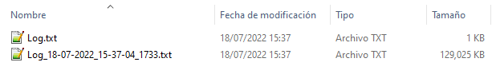
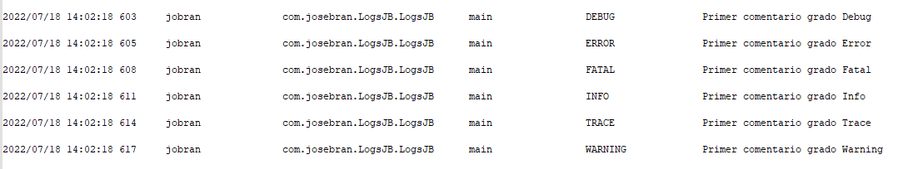
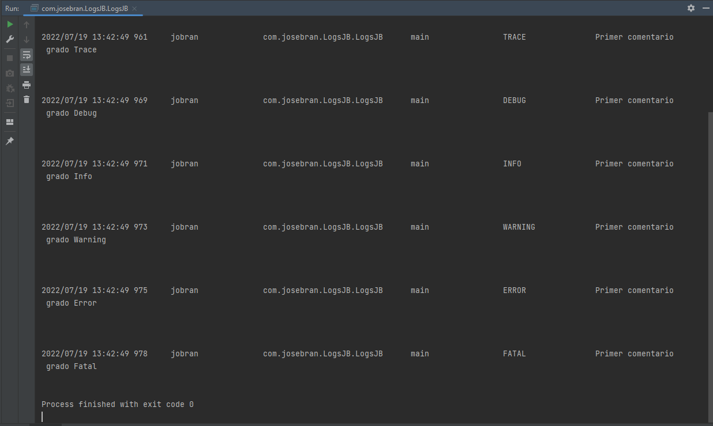
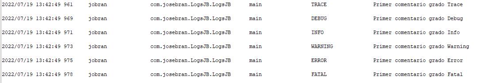

# LogsJB :computer: 
LogsJB es una librería java que permite la gestión de 
registros de un programa en paralelo a la ejecución 
del programa, lo cual la hace una potente herramienta para programas empresariales y personales 
que exigen grandes niveles de rendimiento. 
* * *
## Estado del Proyecto :atom:  
LogsJB actualmente está en una etapa de desarrollo continuo, por lo cual sus observaciones y recomendaciones, 
son bienvenidas para mejorar el proyecto.
***

## Configuración :gear: 
Utilizar LogsJB es muy fácil. LogsJB viene con una configuración por default.

### Configuración por Default de LogsJB
- Los registros se almacenan en ContextRoute/Logs/fecha_actual/Log.txt

Donde:

ContextRoute es la ruta del programa actual en ejecución. 

Logs es una carpeta creada en el directorio de la aplicación
En el cual se crea automáticamente una carpeta por cada día en el que se crea un Log.txt.

- El tamaño máximo de un log es de 125Mb 

Al superarse el tamaño máximo por default de Log.txt, se modificará el nombre de este a la siguiente notación
Log_dd-MM-YYYY_HH-MM-SSS.txt y se seguirán escribiendo los registros en Log.txt

- Los registros en Log.txt tienen un grado igual o superior a Info.

Por default se registran únicamente los registros con un grado igual o mayor al grado que posee el NivelLog.INFO.

Así se ven los registros generados en Log.txt

| Fecha y Hora | Usuario | Clase | Método | Nivel Log | Mensaje |
|--------------|---------|-------|--------|-----------|---------|

Las primeras cuatro columnas son generadas automáticamente por LogsJB
estas cuatro columnas son:

| Fecha y Hora | Usuario | Clase | Método |
|--------------|---------|-------|--------|

Donde: 

Fecha y Hora, es el momento exacto en el que se llamó la escritura del registro.

Usuario, es el usuario actual del programa, la librería por default coloca el usuario del sistema operativo, pero este puede
ser modificado de acuerdo a la necesidad del usuario de la librería.

Clase, es la dirección completa de la clase a la cual pertenece el método que llamo a la escritura del registro.

Método, es el método que hizo el llamado a la escritura del registro.

Mientras que las últimas dos columnas indican lo siguiente:

| Nivel Log | Mensaje |
|-----------|---------|

Donde:

Nivel Log, índica el tipo de registro que es. Los tipos de registro disponibles son: **Trace, Debug, Info, Warning, Error y Fatal**.

Mensaje, es el Mensaje que el usuario índico que quería registrar.
***

### ¿Configuración de LogsJB de acuerdo a las necesidades de mi implementación?

LogsJB puede ser configurada de acuerdo a las necesidades de la implementación que usted esté realizando.

- Establecer que el Log se almacene en una BD's.

Usted puede configurar LogsJB para que los registros se almacenen en una tabla de BD's.
~~~
/**
 * Setea la bandera que índica a LogsJB si se escribirá el log en BD's
 * @param writeDB True si se desea escribir el Log en BD's, False si se desea
 *                que no se escriba el Log en BD's
 */
setWriteDB(true);
/**
 * Configuración de la Base De Datos en la cual volcaría los Logs
 * Para mayor información sobre las BD's a las cuales puede volcal los Logs, visite el siguiente enlace
 * https://github.com/Jbranadev/JBSqlUtils
 *
 * LogsJBDB brinda acceso a los metodos de configuración de conexión de JBSqlUtils
 */
String separador = System.getProperty("file.separator");
String BDSqlite = (Paths.get("").toAbsolutePath().normalize().toString() + separador +
        "Logs" +
        separador +
        "LogsJB.db");
LogsJBDB.setDataBaseGlobal(BDSqlite);
LogsJBDB.setDataBaseTypeGlobal(DataBase.SQLite);
LogsJBDB.setHostGlobal("Host");
LogsJBDB.setUserGlobal("User");
LogsJBDB.setPortGlobal("Port");
LogsJBDB.setPropertisUrlConexionGlobal("PropetiesURLConexión");
~~~

- Establecer que el Log se envíe a un RestAPI.

Usted puede configurar LogsJB para que los registros sean enviados a un RestAPI.
~~~
/**
 * Setea la bandera que índica si se envíaran los logs a un RestAPI
 * @param writeRestAPI True si se desea envíar el Log a un RestAPI,
 *                     False si no se desea que se envíen los Logs a un RestAPI
 *
 * Para mas información sobre la configuración del RestAPI al que nos vamos a conectar puede visitar el siguiente
 * enlace, ya que hacemos uso de la Librería JBRestAPI para el envio del Log
 *                     https://github.com/Jbranadev/JBRestAPI
 * Al servidor se envía el siguiente JSON por medio de un metodo POST
 *      {"nivelLog":"","texto":"", "fecha":"", "clase":"", "metodo":""}
 */
setWriteRestAPI(false);
setKeyLogRest("sdfasf");
setUrlLogRest("http://localhost:8080/WebServicesPrueba/Logs");
setTipeautentication(typeAutentication.BEARER);
~~~

- Establecer que el Log se registre en un archivo txt.

Usted puede configurar LogsJB para que los registros sean estampados en un archivo de texto.
~~~
/**
 * Setea la bandera que índica a LogsJB si se escribirá el log en el archivo TXT
 * @param writeTxt True si se desea escribir el Log en el archivo TXT, False si se desea
 *                 que no se escriba el Log en el archivo TXT
 */
setWriteTxt(true);
~~~

- Modificar la ruta de almacenamiento de los registros.

Usted puede modificar la ruta de almacenamiento de los registros de su implementación de la siguiente manera.
~~~
/**
 * Setea la ruta en la cual se desea que escriba el Log.
 * @param Ruta Ruta del archivo .Txt donde se desea escribir el Log.
 */
LogsJB.setRuta(Ruta);
~~~

- Modificar el tamaño máximo que puede tener su archivo de registros.

Usted puede modificar el tamaño que desea que tenga cada archivo de registros de su implementación.
~~~
/***
 * Setea el tamaño maximo para el archivo Log de la aplicación actual.
 * @param SizeLog Tamaño maximo del archivo sobre el cual se estara escribiendo el Log.
 *      * Little_Little = 125Mb,
 *      * Little = 250Mb,
 *      * Small_Medium = 500Mb,
 *      * Medium = 1,000Mb,
 *      * Small_Large = 2,000Mb,
 *      * Large = 4,000Mb.
 * El valor por defaul es Little_Little.
 */
LogsJB.setSizeLog(SizeLog.Little_Little);
~~~

- Modificar el grado de registros que se estarán reportando.
~~~
/***
 * Setea el NivelLog desde el cual deseamos se escriba en el Log de la aplicación actual.
 * @param GradeLog Nivel Log desde el cual hacía arriba en la jerarquia de logs, deseamos se reporten
 *      * Trace = 200,
 *      * Debug = 400,
 *      * Info = 500,
 *      * Warning = 600,
 *      * Error = 800,
 *      * Fatal = 1000.
 * El valor por defaul es Info. Lo cual hace que se reporten los Logs de grado Info, Warning, Error y Fatal.
 */
LogsJB.setGradeLog(NivelLog.INFO);
~~~

- Modificar el usuario que se graba en el registro.
~~~
/***
 * Setea el nombre del usuario del sistema sobre el cual corre la aplicación
 * @param Usuario Usuario actual del sistema que se desea indicar al Log.
 */
LogsJB.setUsuario(Usuario);
~~~
* * *

## ¿Cómo usar LogsJB?
Usar LogsJB es más fácil que hacer un llamado a System.out.println(mensaje), ya que al llamar a los métodos de registro
de LogsJB se escribe el mensaje en la salida de la terminal del programa y en el archivo Log.txt, con menos esfuerzo del necesario
para hacer un System.out.println(mensaje).

~~~
/**
* Una vez se a importado los métodos estáticos de LogsJB
* Se puede hacer el llamado invocando al método estático de las siguientes dos maneras:
* LogsJB.debug(Mensaje);
* debug(Mensaje);
* @param Mensaje es un String que indica el mensaje que queremos registrar en la salida de la terminal,
* como en el archivo Logs.txt
*/
 
//Comentario grado Trace
trace( "Primer comentario grado Trace");
//Comentario grado Debug
debug( "Primer comentario grado Debug");
//Comentario grado Info
info( "Primer comentario grado Info");
//Comentario grado Warning
warning( "Primer comentario grado Warning");
//Comentario grado Error
error( "Primer comentario grado Error");
//Comentario grado Fatal
fatal( "Primer comentario grado Fatal"); 
~~~

Salida en la terminal

Salida en Log.txt

* * *
## ¿Cómo Obtener LogsJB para usarlo en mi proyecto?
Puedes obtener la librería LogsJB de la siguiente manera

Maven 
~~~
<dependency>
    <groupId>io.github.josecarlosbran</groupId>
    <artifactId>LogsJB</artifactId>
    <version>0.6.2</version>
</dependency>
~~~

Gradle
~~~
implementation 'io.github.josecarlosbran:LogsJB:0.6.2'
~~~

Para mayor información sobre como descargar LogsJB desde otros 
administradores de paquetes, puedes ir al siguiente Link
<https://search.maven.org/artifact/io.github.josecarlosbran/LogsJB>

***

## Licencia :balance_scale: 
LogsJB es una librería open source desarrollada por José Bran, para la administración
de los registros de un programa, con licencia de Apache License, Versión 2.0;

No puede usar esta librería excepto de conformidad con la Licencia.
Puede obtener una copia de la Licencia en http://www.apache.org/licenses/LICENSE-2.0 

A menos que lo exija la ley aplicable o se acuerde por escrito, el software
distribuido bajo la Licencia se distribuye "TAL CUAL",
SIN GARANTÍAS NI CONDICIONES DE NINGÚN TIPO, ya sean expresas o implícitas.
Consulte la Licencia para conocer el idioma específico que rige los permisos y
limitaciones bajo la Licencia.

***
