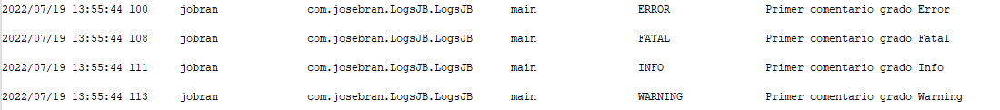

# LogsJB :computer: 
LogsJB es una librería java que permite la gestión de 
registros de un programa en paralelo a la ejecución 
del programa, lo cual la hace una potente herramienta para programas empresariales y personales 
que exigen grandes niveles de rendimiento. 
* * *
## Estado del Proyecto :atom:  
LogsJB actualmente está en una etapa de desarrollo continuo, por lo cual sus observaciones y recomendaciones, 
son bienvenidas para mejorar el proyecto.
***

## Configuración :gear: 
Utilizar LogsJB es muy fácil. LogsJB viene con una configuración por default.

### Configuración por Default de LogsJB
- Los Logs se almacenan en ContextRoute/Logs/fecha_actual/Log.txt

Donde ContextRoute es la ruta del programa actual en ejecución, Logs es una carpeta creada en el directorio de la aplicación
En el cual se crea automáticamente una carpeta por cada día en el que se crea un Log.

- El tamaño máximo de un log es de 125Mb 

Al superarse el tamaño máximo por default de Log, se modificará el nombre de este a la siguiente notación
Log_dd-MM-YYYY_HH-MM-SSS.txt y se seguirán escribiendo los Logs en Log.txt

- Los Logs que se registran en Log.txt tienen un grado igual o superior a Info.

Por default se registran únicamente los registros con un grado igual o mayor al grado que posee el NivelLog.INFO.

Así se ven los registros generados en Log.txt

| Fecha y Hora | Usuario | Clase | Método | Nivel Log | Mensaje |
|--------------|---------|-------|--------|-----------|---------|

Las primeras cuatro columnas son generadas automáticamente por LogsJB
estas cuatro columnas son:

| Fecha y Hora | Usuario | Clase | Método |
|--------------|---------|-------|--------|

Donde: 

Fecha y Hora, es el momento exacto en el que se llamó la escritura del registro.

Usuario, es el usuario actual del programa, la librería por default coloca el usuario del sistema operativo, pero este puede
ser modificado de acuerdo a la necesidad del usuario de la librería.

Clase, es la dirección completa de la clase a la cual pertenece el método que llamo a la escritura del registro.

Método, es el método que hizo el llamado a la escritura del registro.

Mientras que las últimas dos columnas indican lo siguiente:

| Nivel Log | Mensaje |
|-----------|---------|

Donde:

Nivel Log, índica el tipo de registro que es. Los tipos de registro disponibles son: Trace, **Debug, Info, Warning, Error y Fatal**.

Mensaje, es el Mensaje que el usuario índico que quería registrar.

* * *
## ¿Cómo Obtener LogsJB para usarlo en mi proyecto?
Puedes obtener la librería LogsJB de la siguiente manera

Maven 
~~~
<dependency>
    <groupId>io.github.josecarlosbran</groupId>
    <artifactId>LogsJB</artifactId>
    <version>0.3</version>
</dependency>
~~~

Gradle
~~~
implementation 'io.github.josecarlosbran:LogsJB:0.3'
~~~

Para mayor información sobre como descargar LogsJB desde otros 
administradores de paquetes, puedes ir al siguiente Link
<https://search.maven.org/artifact/io.github.josecarlosbran/LogsJB>

***

## Licencia :balance_scale: 
LogsJB es una librería open source desarrollada por José Bran, para la administración
de los registros de un programa, con licencia de Apache License, Versión 2.0;

No puede usar esta librería excepto de conformidad con la Licencia.
Puede obtener una copia de la Licencia en http://www.apache.org/licenses/LICENSE-2.0 

A menos que lo exija la ley aplicable o se acuerde por escrito, el software
distribuido bajo la Licencia se distribuye "TAL CUAL",
SIN GARANTÍAS NI CONDICIONES DE NINGÚN TIPO, ya sean expresas o implícitas.
Consulte la Licencia para conocer el idioma específico que rige los permisos y
limitaciones bajo la Licencia.

***
